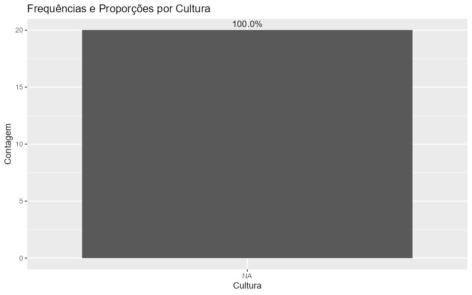

## Visão Geral

**Fase 2 — Capítulo 7.** Este relatório apresenta validação, estatísticas descritivas e visualizações de produtividade agrícola (CONAB/IBGE como referência).

## Estatísticas

```{r}
desc_geral <- readr::read_csv("document/relatorios/estatisticas_geral.csv", show_col_types = FALSE)
desc_por_cultura <- readr::read_csv("document/relatorios/estatisticas_por_cultura.csv", show_col_types = FALSE)

desc_geral
desc_por_cultura
```

## Gráficos

### Histograma + Densidade


### Produtividade por Cultura


### Frequências por Cultura (com proporções)


### Feijão — Subtipos (média)


